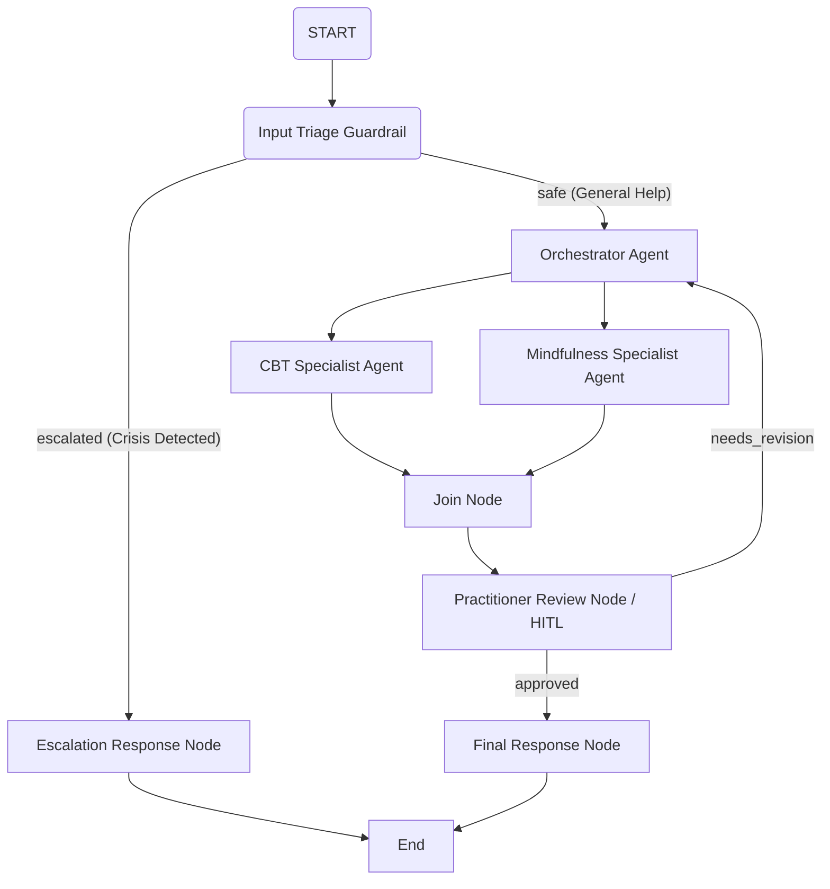

# Implementation Plan: MindCompass Mental Health Agent

This document outlines the design and implementation strategy for **MindCompass**, a Multi-Agent Mental Health System built on Google ADK 2.0. 

---

## 1. System Architecture Overview

MindCompass utilizes a graph-based multi-agent workflow to orchestrate safe, context-aware, and structured cognitive behavioral support. The system uses a clean separation of concerns:
1. **Safety Triage (Guardrail)**: Immediate filtering of inputs for crisis/self-harm signals.
2. **Orchestrator & Specialized Agents**: LLM agents specializing in Cognitive Behavioral Therapy (CBT) and Mindfulness.
3. **MCP Tool Integration**: An MCP server interface for retrieving mental health exercises, local support centers, and grounding resources.
4. **Human-in-the-Loop (HITL) Validation**: A practitioner review step requiring manual approval before sending clinical or highly sensitive guidance to the user.

### Graph Topology

---

## 2. Component Design

### A. Input Triage Guardrail
* **Type**: `FunctionNode`
* **Purpose**: Inspect the incoming message for crisis signals (e.g., self-harm, suicidal ideation, medical emergencies).
* **Behavior**:
  - Uses basic rule-based regex or a lightweight classification call.
  - Returns `Event(output=..., route="escalated")` if a crisis is detected, routing immediately to a supportive crisis hotline card and bypassing all downstream agents.
  - Returns `Event(output=..., route="safe")` otherwise, allowing general processing.

### B. Specialized Agents
* **Orchestrator Agent**: An `LlmAgent` that acts as the entry point for the safe conversation. It reads the triage output and routes sub-tasks or delegates context to specific agents.
* **CBT Specialist Agent**: An `LlmAgent` trained in cognitive reframing, identifying cognitive distortions, and diary logs.
* **Mindfulness Specialist Agent**: An `LlmAgent` offering breathing exercises, physical grounding, and meditation.

### C. Human-in-the-Loop (HITL) Validation
* **Type**: `FunctionNode` (with `rerun_on_resume=False` or `rerun_on_resume=True` depending on revision loop).
* **Behavior**:
  - Yields `RequestInput(interrupt_id="practitioner_review", message="Please review this advice draft before sending it to the user.")` when no resume input exists.
  - Upon receiving the review event (e.g. `approved` vs `needs_revision`), it either routes to the `FinalResponse` or passes feedback back to the `Orchestrator` for refinement.

### D. MCP Server Integration
* **Purpose**: Establish a client connection to an MCP server (e.g., a local clinic directory or grounding exercises list).
* **Structure**:
  - Standard MCP Client instantiation to discover tools from the MCP server.
  - Wrapping of discovered tools into `BaseTool` objects to be registered as ADK tools.

---

## 3. Implementation Phases

### Phase 1: Setup & Environment Configuration
* Generate a `.env` template file containing placeholders for:
  - `GOOGLE_API_KEY` (for Google AI Studio API key)
* Provide instructions on placing the `.env` file in the project directory.

### Phase 2: Core Graph Workflow Skeleton
* Write/modify `app/agent.py` to replace the default `Agent` with `Workflow`.
* Implement:
  - Pydantic models for structured state and outputs.
  - Node definitions (`triage`, `orchestrator`, `cbt_agent`, `mindfulness_agent`, `join`, `review_node`).
  - Edge definitions mapping the safe/escalated and HITL routes.

### Phase 3: Triage Guardrails & Escalation Logic
* Write robust keyword/semantic triage rules.
* Implement the crisis escalation response format showing help phone lines and immediate support materials.

### Phase 4: Human-in-the-Loop Step
* Implement `RequestInput` yield logic inside `practitioner_review`.
* Test the resume mechanism using the local runner and mock resume inputs.

### Phase 5: MCP Tool Integration
* Add a helper to load/call MCP tools.
* Wire the MCP tools directly into the specialized agents' tool lists.

### Phase 6: Verification & Local Testing
* Verify the system using `agents-cli playground` and local pytest scripts.
* Implement evaluations (`eval_config.yaml` and dataset) to ensure quality.
